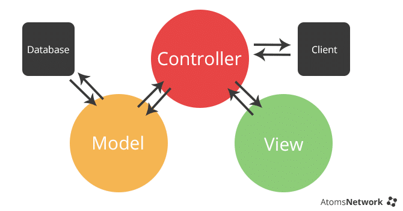

<h1 align="center"> Padrão de projeto MVC </h1>

## Introdução:

Misturar o código de acesso a dados juntamente com à lógica de negócios e a apresentação na construção de sistemas pode gerar inúmeros problemas, pois
torna-se difícil de manter, visto que qualquer alteração que se faça é preciso ter cuidado para não afetar outras partes do sistema. 
Sendo assim, em  busca de softwares de qualidade, com manutenção mais fácil e organizada, além de códigos limpos, usando boas práticas de programação sempre,
deve-se  adotar, para auxiliar no desenvolvimento, padrões de projeto ou arquitetura, que são padrões de alto nível para grandes aplicações que nos permite o reuso de código fonte e expansibilidade do software.
  
#### Desenvolver uma aplicação utilizando algum padrão de projeto pode trazer alguns dos seguintes benefícios: 
- Escalabilidade;
- Aumento de produtividade;
- Uniformidade na estrutura do software;
- Redução de complexidade no código;
- As aplicações ficam mais fácies de manter;
- Facilita a documentação;
- Baixo acoplamento;
- Estabelece um vocabulário comum de projeto entre desenvolvedores;
- Permite a reutilização de módulos do sistema em outros sistemas;
- É considerada uma boa prática utilizar um conjunto de padrões para resolver problemas maiores que, sozinhos, não conseguiriam;
- Ajuda a construir softwares confiáveis com arquiteturas testadas;
- Reduz o tempo de desenvolvimento de um projeto.

## Pattern Model-View-Controller(MVC)

 
Na década de 70, foi criado e introduzido pela primeira vez o conceito (paradigma) de desenvolvimento e design, ou padrão arquitetural como prefirir, MVC (Model, View, Controller), sendo este desenvolvido para ser usado em projetos de interface visual na linguagem de programação Smalltalk-76, linguagem de programação que juntamente com o C++ ganhou grande reconhecimento na época, e ajudar na tarefa de separar as responsabilidades,  promovendo, portanto, um baixo acoplamento e alta coesão, tornando o sistema escalável.     
Mesmo após esses anos, o MVC ainda é um pattern aplicável nas mais variadas aplicações, principalmente em aplicações web.

#### Características da Arquitetura
- Separação entre os códigos, View e Controller que gerencia as relações entre  o Model e a View;
- Separa a lógica de negócios da apresentação;
- Possui re-usabilidade, podemos criar bibliotecas e adicionar interfaces facilmente;
- É possível desenvolver em paralelo, já que os componentes são independentes, ou seja, pode começar o projeto por qualquer camada;
- Divide as responsabilidades, ou seja, programadores na programação e web designers na construção visual do software;
- Facilidade de manutenção do software: a distribuição lógica das funções entre os módulos do sistema isola o impacto das modificações;
- Escalabilidade: Modificações necessária para acompanhar o aumento da demanda de serviços ficam concentradas na camada intermediária;
- Independente de fabricante: usa apenas padrões abertos.

De forma resumida, a base do MVC é separar uma aplicação em três partes distintas sendo uma o Model, esta relacionada ao trabalho atual que a aplicação administra, outra parte a View esta relacionada a exibição dos dados ou informações dessa uma aplicação e a terceira parte, Controller, em coordenar os dois anteriores exibindo a interface correta ou executando algum trabalho que a aplicação precisa completar.

#### Explicando cada um dos objetos do padrão MVC 
  
*Model*: Veja o model como o coração da arquitetura, pois é ele quem modela o problema que está se tentando resolver. Para isso, esta camada contém a 
lógica da aplicação, representa os dados empresariais e as regras de negócio que controlam a atualização desses dados. 
Frequentemente o model funciona como a aproximação de um processo do mundo real. Além disso, é responsável por implementar a lógica da regras de negócio tal qual o
armazenamento persistente. 

*Controller*: Sua função, como o próprio nome define, é coordenar e organizar esta arquitetura, funcionando como intermediário entre a camada de apresentação e a camada de negócios.
O controller define o comportamento da aplicação, é ele quem interpreta as solicitações feitas por usuários e, com base nestes requerimentos, comunica-se com o model que, por sua vez, seleciona a view e atualiza-a para o usuário, ou seja, o controller controla e mapeia as ações.  
Resumindo as funções do controller: 
Ativar processos de negócio;
Mudar o estado do model;
Escolher a view apropriada de acordo com as ações dos usuários e com os resultados das mudanças no model. 

*View*: É a camada responsável pela apresentação, sendo esta a interface que proporcionará à entrada de dados e a visualização de respostas geradas.
Como a view é  responsável por manter a consistência entre a apresentação, esta pode aplicar uma das seguinte estratégias: Cadastrar-se junto ao model
para receber notificações de mudanças ou solicitar ao model o seu estado atual quando for necessário representá-lo.
Portanto, a view deve garantir que sua apresentação reflita o estado do model, quando os dados do model mudam, o model notifica as views que 
dependem dele, ou seja, cada view tem a chance de atualizar-se. Desta maneira, permite ligar muitas views a um model, podendo fornecer diferentes apresentações.
Apesar de ter deixado bem claro (não custa nada frisar), a view não tem conhecimento do que a aplicação está atualmente fazendo, tudo que ela realmente faz é receberinstruções do controller com informações do model e então exibir elas. Além disso, se comunica de volta com o model e com o controlador para reportar o seu estado. 

 
#### Exemplificando o fluxo
Imagine que em um sistema e-commerce, o usuário João(sempre nos exemplos) interaja com a interface ao pressionar um botão para adicionar um item em um carrinho de compra,sendo esta exibida por uma view (como uma página HTML). Após essa ação, a view envia uma requisição ao controller, este vai acessar o model, possivelmente atualizando-o de forma apropriada para as ações do usuário, causando uma alteração no estado do model tanto quanto nas informações.
Por fim, a view recebe as informações do model. Após isso, o controlador, como um gerenciador da interface do usuário, aguarda por mais interações do usuário,onde inicia novamente todo o ciclo.

#### Exemplo de uso
Como exemplo, segue este projeto em que é aplicado a arquitetura MVC, utilizando React no frontend(nossa view) e o node no backend(possuindo os  controllers e models da aplicação).

<a href="https://github.com/JoaoVictorfss/gobaber">gobarber</a>

## Conclusão

Espero que tenha ficado claro os benefícios gerados os se utilizar um padrão de projeto, os conceitos abordados e a importância da arquitetura MVC no desenvolvimento de sistemas até hoje, lembre-se que esse padrão é usado desde a década de 70, então funciona, certo? Boa codificação :smiley: !

## Referências bibliográficas

http://www.facom.ufu.br/~ronaldooliveira/PDS-2019-2/Aula12-MVC.pdf  
http://www.linhadecodigo.com.br/artigo/2367/abordando-a-arquitetura-mvc-e-design-patterns-observer-composite-strategy.aspx  
https://repositorio.ufmg.br/bitstream/1843/BUOS-94MMY9/1/andreyrochaduarte.pdf  
http://revistas.unifenas.br/index.php/RE3C/article/view/54/13  
https://www.devmedia.com.br/introducao-ao-padrao-mvc/29308  
 

 

  
